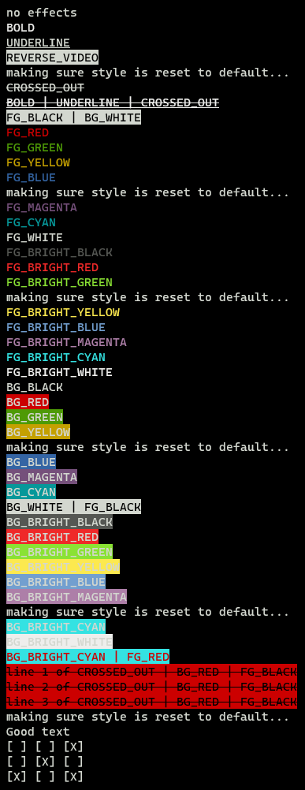

# cpp-term

A small C++ library for stylish terminal output using ANSI escape sequences.

## Using

This is a source-based library, so copy [term.cpp](/term.cpp) and [term.hpp](/term.hpp) somewhere into your project and `#include "term.hpp"` wherever you want to use it.

## Testing

It's a good idea to check if the library works on your target terminal, as ANSI escape sequence support varies. This library uses only the most common sequences so all somewhat-new terminals should work 100%, but if you want to verify here's how:

To test the logic of the library, run:
```
make logic
```

To test the visuals of the library, run:
```
make visuals
```

If your terminal supports the necessary escape sequences, your output should resemble:


